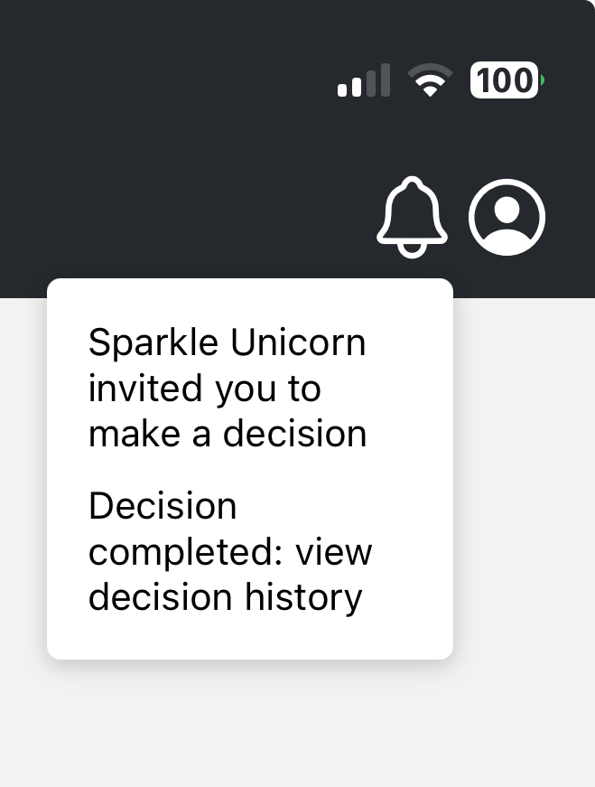

# Dropdown Menu

<figure><figcaption></figcaption></figure>

**DropdownMenu**

* **Description:** A modal which takes a component as a 'trigger' - when pressed the dropdown element appears. It takes children such as the MenuOptions component created specifically for this (documented below)
* **Attributes**
  * `isVisible` boolean
  * `handleClose` function to execute when the overlay is closed (which happens when a user presses outside of the dropdown)
  * `handleOpen` function to execute when the overlay is opened (when a user presses the trigger and the dropdown is not visible)
  * `trigger` ReactNode - the component that the user presses to open the dropdown
  * `dropdownWidth` currently set to 150 automatically - width of the dropdown bar
  * `xPos` currently set to 60 automatically - x position compared to trigger
  * `yPos` currently set to 5 automatically - y position compared to trigger
  * `children` react components to place inside the dropdown - MenuOptions component made to pass in as children (in the same file) as documented below

**MenuOptions**

* **Description:** A white box that can undergo any function when pressed. It can take any react nodes as children to display on the menu option
* **Attributes**
  * `onSelect` function to undergo when menu option is pressed
  * `children` react components to place inside the option box
